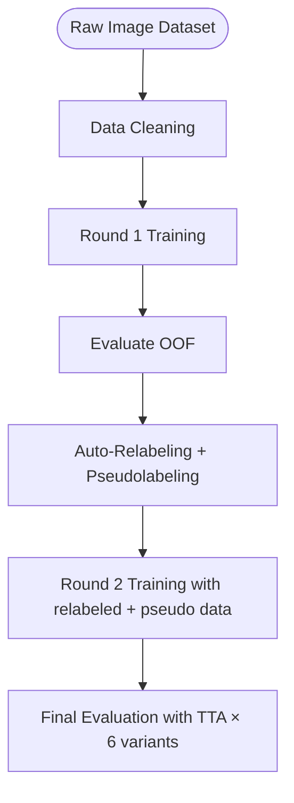
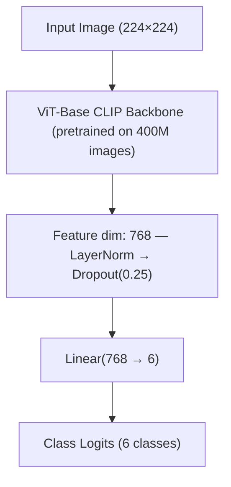
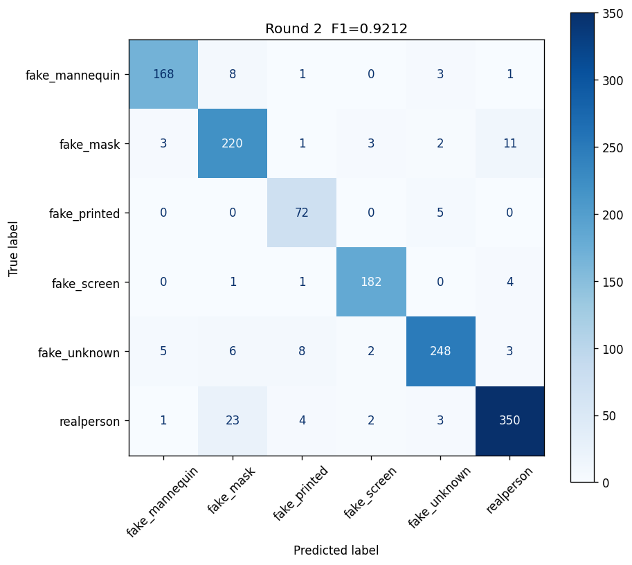
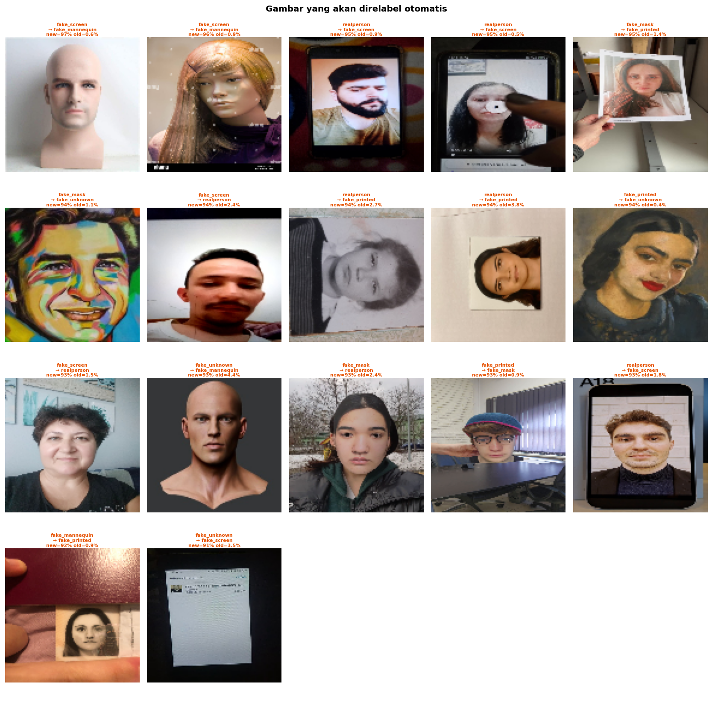
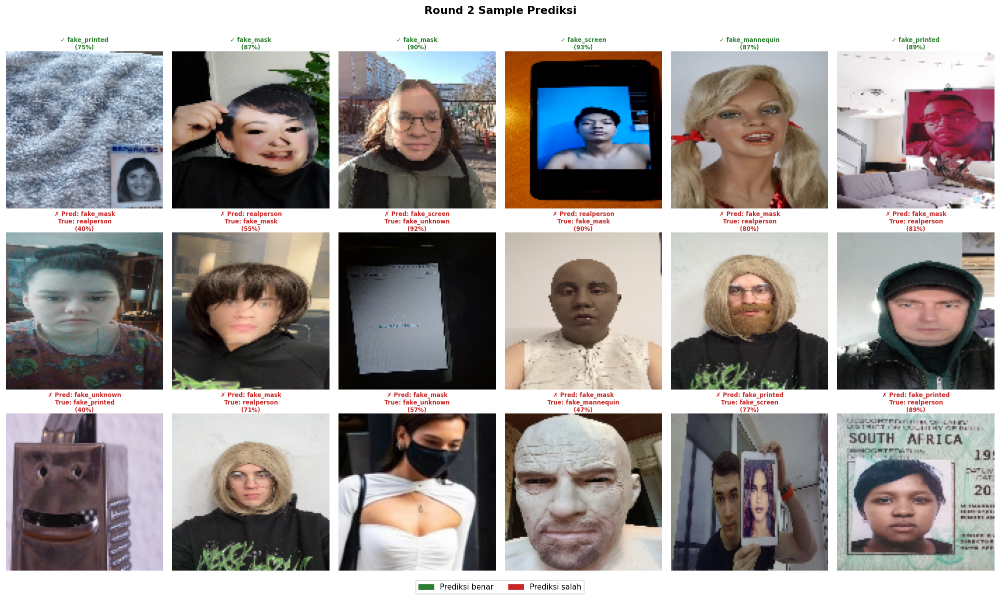

# Face Anti-Spoofing Classifier

A production-ready deep learning system for detecting face presentation attacks. The pipeline classifies facial images into six categories, including a real person and five types of spoof attacks, using a CLIP-pretrained Vision Transformer with a fully automated, self-correcting training strategy.


---

## Project Overview
The emphasis of this project is on **data quality** and **training robustness**: rather than relying solely on model capacity, the pipeline actively detects and corrects label noise, handles real-world image inconsistencies, and augments training data through pseudolabeling.

| **Objective** | Information |
|---|---|
| **Task** | Multi-class face presentation attack detection |
| **Classes** | 6 (1 real, 5 spoof types) |
| **Model** | ViT-Base CLIP (`vit_base_patch16_clip_224.openai_ft_in12k_in1k`) |
| **Metric** | Macro F1-Score |
| **Training** | 2-round self-correcting pipeline with 5-fold cross-validation |

---

## Detected Attack Types

| Class | Description |
|---|---|
| `realperson` | Genuine live face |
| `fake_mannequin` | 3D mannequin or doll |
| `fake_mask` | Physical face mask |
| `fake_printed` | Printed photo attack |
| `fake_screen` | Digital screen replay |
| `fake_unknown` | Other / unclassified spoof |

---

## Tech Stack


| Category | Tools |
|---|---|
| **Deep Learning** | PyTorch, timm, AMP (mixed precision) |
| **Backbone** | ViT-Base CLIP pretrained on 400M images |
| **Augmentation** | Albumentations, custom TTA |
| **Data Processing** | OpenCV, Pillow, Pandas, NumPy |
| **Evaluation** | scikit-learn (F1, classification report, confusion matrix) |
| **Optimization** | SciPy (Nelder-Mead threshold optimizer) |
| **Environment** | Kaggle GPU (T4/P100) |

---

## Pipeline



---

## Technical Highlights

### Self-Correcting Label Noise Detection

One of the core contributions of this pipeline is its ability to identify and correct mislabeled training samples fully automatically. After Round 1 training, out-of-fold (OOF) predictions are analyzed to flag images where the model is highly confident in a *different* class than the assigned label.
**Relabeling criteria (deterministic, no human intervention):**
- Model confidence toward the predicted class ≥ 90%
- Model confidence toward the original label ≤ 5%

### Pseudolabeling for Unlabeled Data
Unlabeled images with high-confidence predictions (≥ 85%) are added to the training set before Round 2, effectively expanding the training distribution and improving generalization on harder examples.

### Two-Phase Training Strategy
| Phase | Epochs | LR | Backbone |
|---|---|---|---|
| Phase 1 | 3 | 5e-4 | Frozen (head only) |
| Phase 2 | 15 | 2e-5 | Unfrozen (full fine-tune) |

Phase 1 prevents gradient instability by warming up the classification head before the backbone is exposed to large gradient updates. This is particularly important for small datasets.

### Augmentation Pipeline
Training augmentations are designed to simulate real-world spoof artifacts:
- **Blur**: motion blur & Gaussian blur (simulate screen/print artifacts)
- **Compression**: JPEG quality 40–95 (simulate re-encoded or re-photographed images)
- **Color/lighting**: brightness, contrast, color jitter, hue/saturation, gamma
- **Noise**: Gaussian noise & ISO noise (simulate sensor variability)
- **Geometry**: random crop, flip, shift, scale, rotation, shadow
- **Occlusion**: CoarseDropout (random patches masked out)

**TTA (Test-Time Augmentation):** 6 variants averaged at inference, include original, horizontal flip, brightness+, brightness−, slight rotation, center crop from slightly larger resize.

---

## Model Architecture



- **Backbone:** `vit_base_patch16_clip_224.openai_ft_in12k_in1k` via `timm`
- **Loss:** Weighted Label Smoothing Cross-Entropy — handles class imbalance via inverse-frequency class weights, smoothing factor 0.1
- **Optimizer:** AdamW with weight decay 1e-4
- **Scheduler:** Linear warmup → Cosine annealing (Phase 1) / Cosine annealing (Phase 2)
- **Regularization:** Mixup (α=0.2), label smoothing, dropout, drop path (0.1)
- **Mixed precision:** AMP on GPU with compute capability ≥ 7.0

---

## Data Quality Pipeline

Real-world face anti-spoofing datasets are noisy. This pipeline addresses the following issues systematically:

| Issue | Solution |
|---|---|
| Duplicate images across classes (label noise) | Perceptual hash (MD5 of 16×16 grayscale) to remove all copies |
| Duplicate images within same class | Perceptual hash to keep one copy |
| Tilted/rotated images from smartphones | Auto-rotate using PIL EXIF tag 274 before augmentation |
| Mislabeled images | OOF-based auto-relabeling with deterministic confidence thresholds |
| Resolution mismatch (256px–4096px) | Normalize max side to 1024px to prevent blur on small images |
| Extremely dark/corrupt images | Brightness threshold — remove images with mean pixel value < 20 |
| Class imbalance | Inverse-frequency class weights in loss function |

---

## Results

<p align="center">
  
  
</p>
<p align="center">
  
</p>

---

## Reproducibility

The entire pipeline is deterministic and requires zero manual steps:

- `set_seed(42)` locks NumPy, PyTorch, CUDA, and Python hash randomness
- Auto-relabeling uses fixed confidence thresholds (`conf_new ≥ 0.90`, `conf_old ≤ 0.05`)
- Pseudolabeling uses a fixed threshold (`0.85`)

---

## Repository Structure

```
face-anti-spoofing/
│
├── README.md
│
├── notebook/
│   └── face_anti_spoofing.ipynb       # End-to-end notebook
│
├── assets/
│   ├── confusion_matrix.png           # Confusion matrix visualization
│   ├── relabel.png                    # Auto-relabeling candidates grid
│   └── round_2_predict.png            # Round 2 sample predictions
│
└── requirements.txt
```

---

## License

This project is built for portfolio and learning purposes. The dataset comes from Kaggle DAC FindIt 2026.

---

## Author

**Yan Andhinaya Ardika**
- Github: [@yandik](https://github.com/yanardika) 
